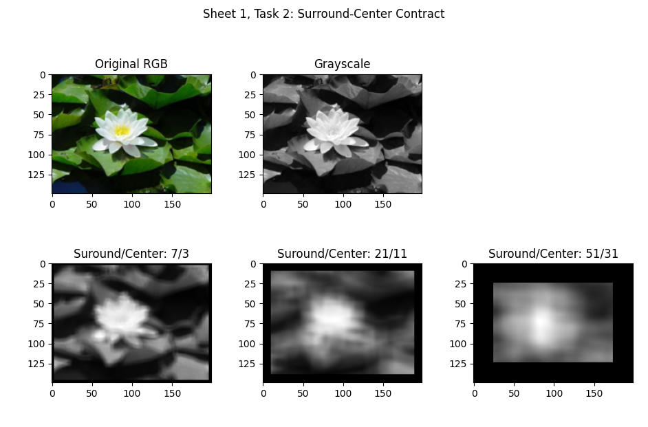

# Sheet 1

## Task 1

```
Bins: 2, correct: 10, false: 20
Bins: 10, correct: 16, false: 14
Bins: 51, correct: 18, false: 12
Bins: 255, correct: 17, false: 13
```

## Task 2



## Task 3

```
p(X) = [0.3, 0.1, 0.2, 0, 0.4, 0]
q(X) = [0, 0.1, 0.3, 0, 0.2, 0.4]
E[p(X)] = 0.3*0 + 0.1*1 + 0.2*2 + 0*3 + 0.4*4 + 0*5 = 2.1
E[q(X)] = 0*0 + 0.1*1 + 0.3*2 + 0*3 + 0.2*4 + 0.4*5 = 3.5
P(X) = [0.3, 0.4, 0.6, 0.6, 1.0, 1.0]
Q(X) = [0.0, 0.1, 0.4, 0.4, 0.6, 1.0]
manhatten: sqrt(|(0.3-0)| + |(0.1-0.1)| + |(0.2-0.3)| + |(0-0)| + |(0.4-0.2)| + |(0-0.4)|) = 1.0
```