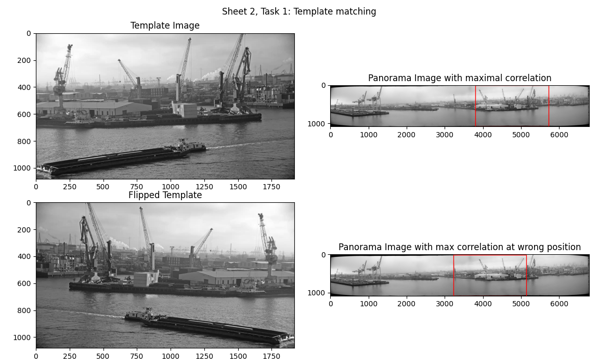
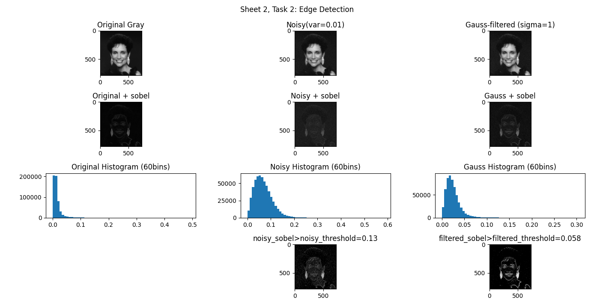
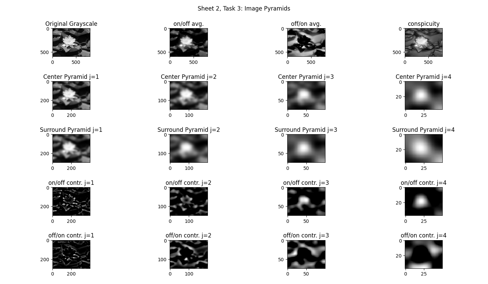

# Sheet 2

## Task 1

## Task 2

### Question: Why is edge detection improved by applying smoothing?

Edge detection is improvied by applying smoothing because
high frequency noise in a signal leads to the signal values jumping up and down
so it creates many position and negative gradients in the signal.
Gradients are also what we interepret is edges. So when detecting edges we try to find
gradients but in a noisy signal we get many false-positive results.

## Task 3

### Question: What advantage does using this approach based on image pyramids have over the integral image method from assignment sheet 1?

When applying a filter to a signal the computational complexity depends both on the
filter size and on the signal size.
So instead of applying multiple increasing filter sizes to a single large image
it is more efficient to apply a single smaller filter to multiple smaller images.
For the result only the relative size between the image and the filter matters.
The gaussian filter is a lowpass filter so we know we can discard high frequencies anyway
by downsampling the image.