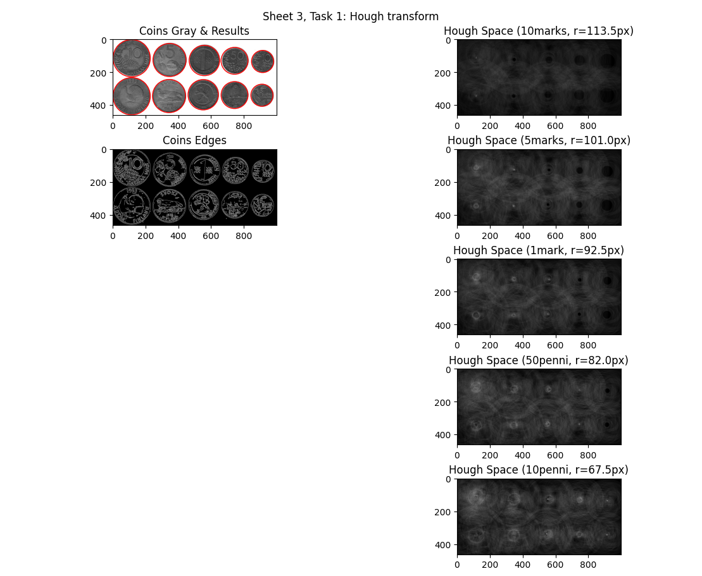

# Sheet 3

## Task 1



## Task 2


## Task 3

In each iteration the probability of selecting ONLY inliers ist e^m. The Probability of NOT ONLY selecting inliers is `(1-e^m)`.

Each iteration is independent so NOT finding a selection of ONLY inliers after `k` iterations is: `(1-e^m)^k`.
We call this a failure. We want this to happen with a probability lower than q:

```
q >= (1-e^m)^k
```

We call the probability that it does not happen `p`. 

```
p = (1-q)  <-> q = 1-p
```

```
(1-p) >= (1-e^m)^k
```

Now we resolve for k:

```
log(1-p) >= log((1-e^m)^k)
log(1-p) >= k * log(1-e^m)
log(1-p) / log(1-e^m) =< k  # > inverts because the log is negative
```